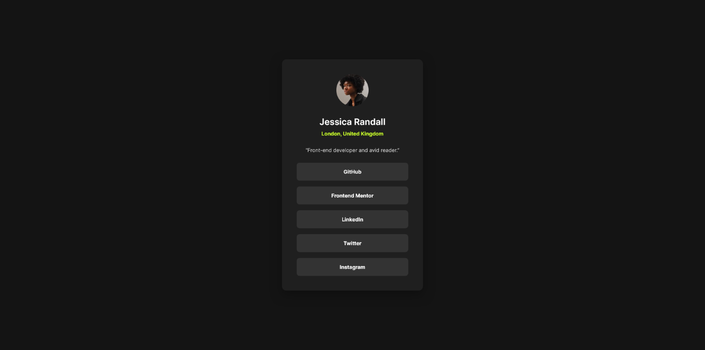

# Frontend Mentor - Social links profile solution

This is a solution to the [Social links profile challenge on Frontend Mentor](https://www.frontendmentor.io/challenges/social-links-profile-UG32l9m6dQ).

## Table of contents

- [Overview](#overview)
  - [The challenge](#the-challenge)
  - [Screenshot](#screenshot)
  - [Links](#links)
- [My process](#my-process)
  - [Built with](#built-with)
  - [What I learned](#what-i-learned)
  - [Continued development](#continued-development)
  - [Useful resources](#useful-resources)
- [Author](#author)

## Overview

### The challenge

Users should be able to:

- See hover and focus states for all interactive elements on the page

### Screenshot



### Links

- Solution URL: [https://github.com/muchiribytes/social-links-profile](https://github.com/muchiribytes/social-links-profile)
- Live Site URL: [https://muchiribytes.github.io/social-links-profile/](https://muchiribytes.github.io/social-links-profile/)

## My process

### Built with

- Semantic HTML5 markup
- CSS custom properties
- Flexbox layout
- Fluid typography and spacing using `clamp()`
- Block Element Modifier (BEM) naming convention
- WCAG accessibility standards (keyboard navigation, `visually-hidden` footer, `:focus-visible` outlines)
- Comprehensive SEO, Open Graph, and Twitter Cards meta tags

### What I learned

During this challenge, I reinforced writing structured semantic HTML alongside BEM methodology. I also implemented a visually hidden footer to maintain accessibility for screen readers without distorting the design layout.

```html
<!-- Accessible visually-hidden footer for assistive technologies -->
<footer class="attribution visually-hidden">
  Challenge by
  <a
    href="[https://www.frontendmentor.io?ref=challenge](https://www.frontendmentor.io?ref=challenge)"
    target="_blank"
    rel="noopener noreferrer"
    >Frontend Mentor</a
  >. Coded by
  <a
    href="[https://github.com/muchiribytes](https://github.com/muchiribytes)"
    target="_blank"
    rel="noopener noreferrer"
    >Muchiri Bytes</a
  >.
</footer>
```

```css
/* Screen-reader utility class */
.visually-hidden {
  position: absolute;
  width: 1px;
  height: 1px;
  padding: 0;
  margin: -1px;
  overflow: hidden;
  clip: rect(0, 0, 0, 0);
  white-space: nowrap;
  border: 0;
}

/* Custom focus ring for keyboard navigation */
.profile-card__link:focus-visible {
  background-color: var(--clr-green);
  color: var(--clr-grey-900);
  outline: none;
  box-shadow: 0 0 0 3px var(--clr-white);
}
```

### Continued development

In future projects, I plan to continue refining:

- Advanced CSS architecture using modular structures.
- Deepening custom accessibility patterns for complex UI elements.
- Building interactive components using modern vanilla JavaScript DOM manipulation.

### Useful resources

- [MDN Web Docs - Accessibility](https://developer.mozilla.org/en-US/docs/Web/Accessibility?utm_source=gemini) - Excellent resource for understanding accessibility guidelines and standard `visually-hidden` patterns.
- [A Complete Guide to Flexbox](https://css-tricks.com/snippets/css/a-guide-to-flexbox/?utm_source=gemini) - Useful reference for alignment and layout patterns.

## Author

- Frontend Mentor - [@muchiribytes](https://www.google.com/search?q=https://www.frontendmentor.io/profile/muchiribytes&utm_source=gemini)
- Twitter - [@muchiribytes](https://www.google.com/search?q=https://x.com/muchiribytes&utm_source=gemini)
